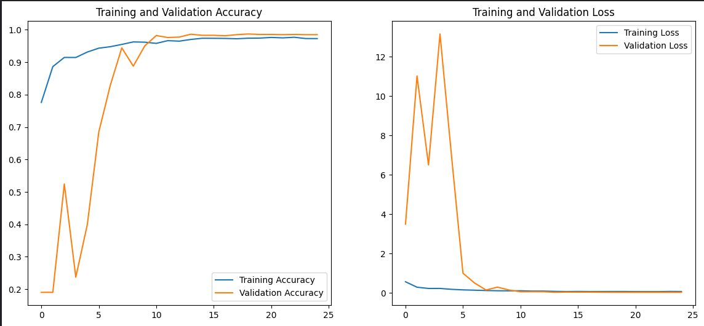

# 🍚 Rice Image Classification: 99% Accuracy with Custom CNN


## 📌 Project Overview
This project implements a high-performance **Custom Convolutional Neural Network (CNN)** to classify 5 different varieties of rice (*Arborio, Basmati, Ipsala, Jasmine, Karacadag*) with over **99% accuracy**.

Unlike standard Transfer Learning approaches, this model is built from scratch to demonstrate the power of specialized architectures for specific datasets. The project is optimized for **Dual T4 GPU** setups using TensorFlow's `MirroredStrategy` and features a **RAM-safe data pipeline** to handle large datasets efficiently.

## 🚀 Key Features
* **Custom CNN Architecture:** A robust 4-block CNN designed specifically for texture and shape feature extraction.
* **High Accuracy:** Achieved **99.18% Test Accuracy** with minimal loss.
* **Dual GPU Support:** Utilizes `tf.distribute.MirroredStrategy` for parallel training.
* **RAM Optimization:** Implements a controlled manual data loading mechanism to prevent OOM (Out of Memory) errors on limited RAM environments (like Kaggle/Colab).
* **Advanced Evaluation:** Includes Confusion Matrix, Classification Reports, and Error Analysis visualizations.

## 📂 Dataset
The dataset used in this project is the **Rice Image Dataset** by Murat Koklu.
* **Classes:** Arborio, Basmati, Ipsala, Jasmine, Karacadag.
* **Total Images Used:** 7,500 (1,500 per class balanced subset).
* **Original Source:** [Kaggle Rice Image Dataset](https://www.kaggle.com/datasets/muratkokludataset/rice-image-dataset)

## 🛠️ Installation

1.  Clone the repository:
    ```bash
    git clone https://github.com/goktani/Rice-Image-Classification-Custom-CNN.git
    cd Rice-Image-Classification-Custom-CNN
    ```

2.  Install dependencies:
    ```bash
    pip install -r requirements.txt
    ```

## 🧠 Model Architecture
The model consists of a sequential custom CNN with the following structure:
1.  **Input Layer:** 224x224x3 images.
2.  **Data Augmentation:** Random Flip, Rotation, and Zoom to prevent overfitting.
3.  **Convolutional Blocks (x4):** Each block contains `Conv2D`, `BatchNormalization`, `ReLU Activation`, and `MaxPooling2D`.
4.  **Classification Head:** `GlobalAveragePooling2D`, `Dropout (0.4)`, Dense layer (256 units), and Softmax Output.

## 📊 Results & Visualization

### Accuracy & Loss Curves
The model shows stable convergence with no signs of overfitting, thanks to Batch Normalization and Dropout techniques.



### Confusion Matrix
The model distinguishes between similar rice types (e.g., Jasmine vs. Basmati) with high precision.


### Performance Metrics
| Class | Precision | Recall | F1-Score |
|-------|-----------|--------|----------|
| Arborio | 1.00 | 0.99 | 1.00 |
| Basmati | 0.99 | 0.98 | 0.99 |
| Ipsala | 1.00 | 1.00 | 1.00 |
| Jasmine | 0.98 | 0.99 | 0.99 |
| Karacadag | 1.00 | 1.00 | 1.00 |

## 💻 Usage

To train the model from scratch, run the Jupyter Notebook provided in the repo. Ensure you have a GPU enabled environment for faster training.

```python
# Load the notebook and run all cells
Rice_Classification_Custom_CNN.ipynb
```
## 🤝 Contributing
Contributions, issues, and feature requests are welcome!

## 📜 License
This project is licensed under the MIT License.
